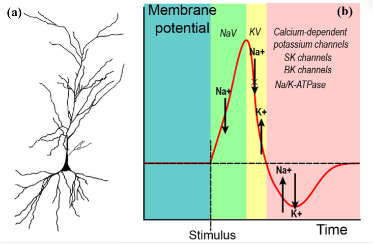

# Changes in Intrinsic Excitability of Hippocampal Pyramidal Cells in Parkinson's Disease Model: A Promising Target

## Research Overview

This study investigated changes in intrinsic excitability of hippocampal pyramidal cells using a Parkinson's Disease (PD) model. The research focused on analyzing spike train characteristics and action potential features to understand how PD affects neuronal firing patterns and membrane properties.

For further reference, the full article titled *"Changes in intrinsic excitability of hippocampal pyramidal cells in Parkinson’s disease model"* can be accessed [here](https://www.ewadirect.com/proceedings/tns/article/view/10430).

>
The schematics of pyramidal neurons and action potential and the related ion channels

## What I Did

### Data Collection and Processing
- Collected electrophysiological data from hippocampal pyramidal cells in two groups: intact (control) and PD model
- Processed raw voltage and current recordings from multiple neurons (N1-N10 for intact, N1-N8 for PD)
- Implemented automated spike detection and feature extraction algorithms

### Spike Analysis Pipeline
- Developed a custom Python class (`Data_Class`) for automated data processing
- Extracted spike trains from continuous voltage recordings
- Identified individual action potentials and calculated key electrophysiological parameters
- Analyzed both first and subsequent spikes in each recording

>
The recording from the current clamp and the schematic diagram of the features extracted

### Feature Extraction
- Measured 10 key electrophysiological parameters for each spike:
  - **Voltage parameters**: peak voltage, threshold, minimum afterhyperpolarization (minAHP), amplitude
  - **Temporal parameters**: time-to-peak (TTP-peak), time-to-AHP (TTP-AHP), spike width, first spike latency
  - **Additional metrics**: interspike intervals (ISI) for sequential spikes

## What I Found

### Key Differences Between PD and Intact Groups

**First Spike Characteristics:**
- PD neurons showed altered first spike latency compared to intact controls
- Significant differences in threshold voltage and spike amplitude
- Modified time-to-peak and time-to-AHP parameters

**Spike Train Properties:**
- PD neurons exhibited changes in spike frequency adaptation
- Altered interspike intervals between consecutive action potentials
- Modified spike width and afterhyperpolarization characteristics

**Group-Level Patterns:**
- Consistent differences across multiple neurons in each group
- Distinct electrophysiological signatures between PD and intact conditions
- Changes suggesting altered intrinsic excitability in the PD model

>
Spike train from PD and intact mice, and the morphological comparison between each spike

>
There are evident differences in firing patterns in the first spike among PD and intact mice

## How I Did It

### Technical Approach
1. **Data Processing**: Used pandas and numpy for efficient data manipulation
2. **Spike Detection**: Implemented threshold-based spike identification with voltage cleaning
3. **Feature Calculation**: Automated extraction of electrophysiological parameters
4. **Statistical Analysis**: Applied statistical tests to compare PD vs. intact groups
5. **Visualization**: Created comparative plots using matplotlib and seaborn

### Analysis Workflow
1. **Raw Data Input**: Tab-separated voltage/current recordings
2. **Preprocessing**: Data cleaning and spike train extraction
3. **Feature Extraction**: Automated calculation of 10 key parameters per spike
4. **Data Organization**: Structured output for statistical comparison
5. **Statistical Testing**: Group comparisons with significance testing
6. **Visualization**: Box plots and comparative graphs for key findings

### Code Implementation
- **Main Processing**: `spike_data_processing.py` - Core spike analysis class
- **Feature Analysis**: `Feature processing.ipynb` - Statistical analysis and data organization
- **Visualization**: Custom plotting scripts for comparative analysis
- **Data Management**: Automated CSV export for further statistical analysis

## Significance

This research provides quantitative evidence of altered intrinsic excitability in hippocampal pyramidal cells under PD conditions. The findings suggest that changes in membrane properties and spike generation mechanisms may contribute to cognitive deficits associated with Parkinson's disease, identifying potential therapeutic targets for intervention.

## Data Structure

- **Intact Group**: 10 neurons (N1-N10), multiple spikes per neuron
- **PD Group**: 8 neurons (N1-N8), multiple spikes per neuron
- **Features Analyzed**: 10 electrophysiological parameters per spike
- **Output Format**: Structured CSV files for statistical analysis and visualization
